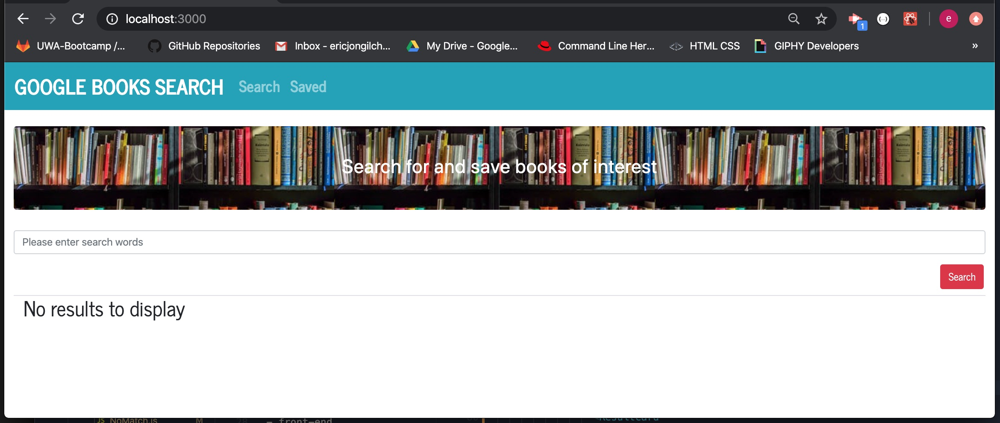
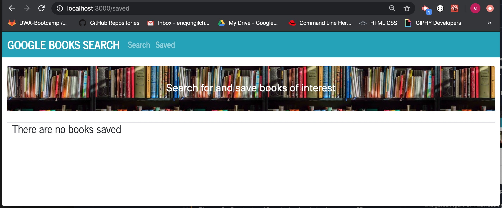
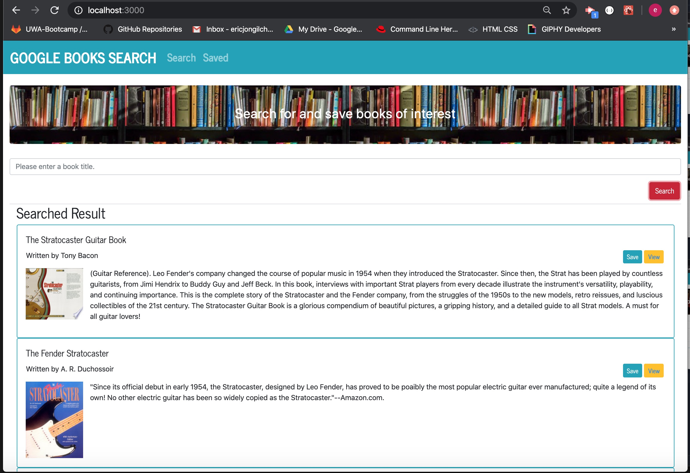
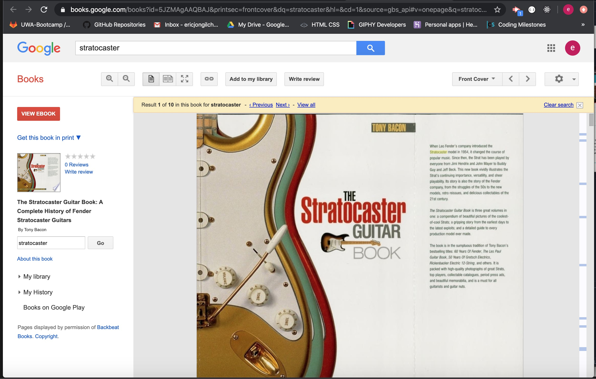
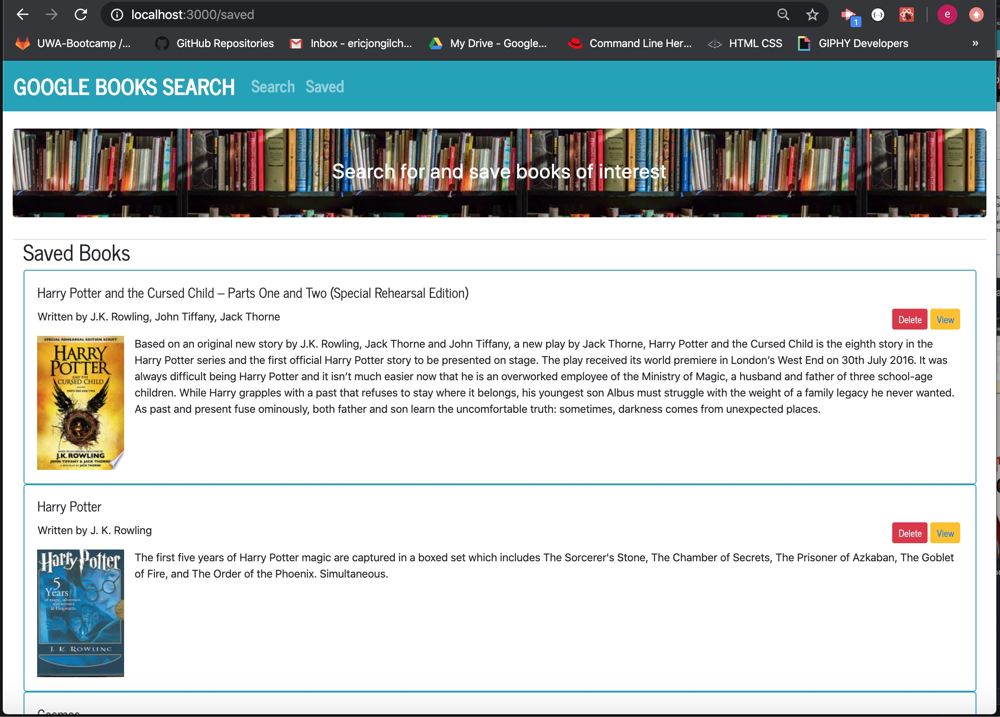
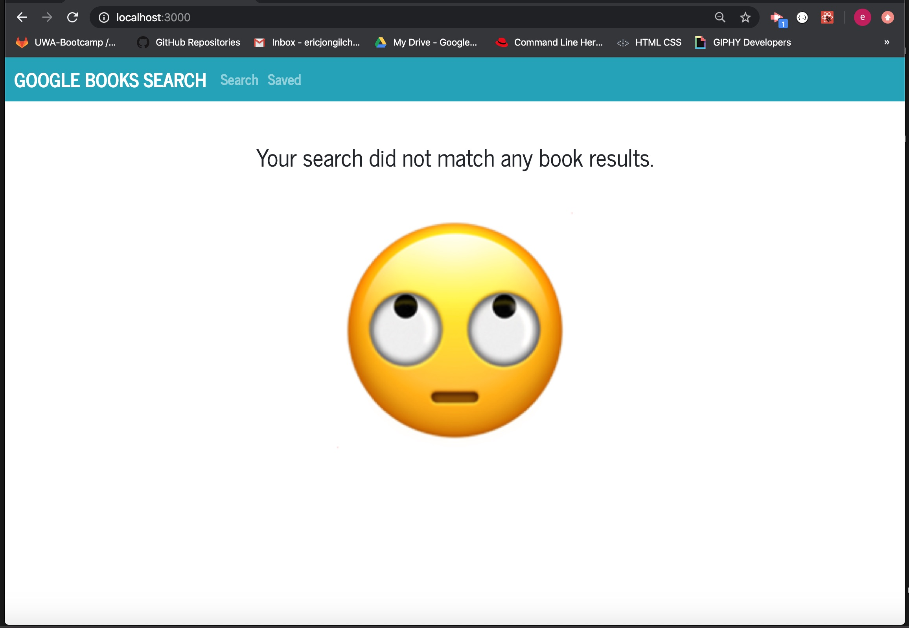

# google-books

## Overview
This app helps user to search books using Google Books API, and save books of interest in MongoDB. `View` button will link to the book's information link. `Delete` button will delete book data from MongoDB.

## App running screenshot

Figure 1. Initial loading of homepage

Figure 2. Initial loading of saved page

Figure 3. Book searched screen after entering search word "stratocaster"

Figure 4. `View` button click opens book's information link page

Figure 5. Rendering `Saved` books data from mongoDB

Figure 6. When the Google Books API couldn't find the result

## Current development
- created Github repo
- created react app using boilerplate
- front-end
- components
- API
- Routes
- connection to mongoDB
- book search and render its results on homepage
- `View` button click opens the book's information link page
- `Save` button click stores the book data into mongoDB
- `Saved` page renders saved book data from mongoDB
- `delete` button click deletes the book data from mongoDB
- handle meaningless search word entry with no match page
- deployment to Heroku

## Technologies used
- HTML, CSS, Javascript, Bootstrap
- node, npm packages
- Google Books API
- Axios
- MongoDB, mongoose
- React, JSX

## [Run app on Heroku](https://shrouded-reef-42849.herokuapp.com/)
