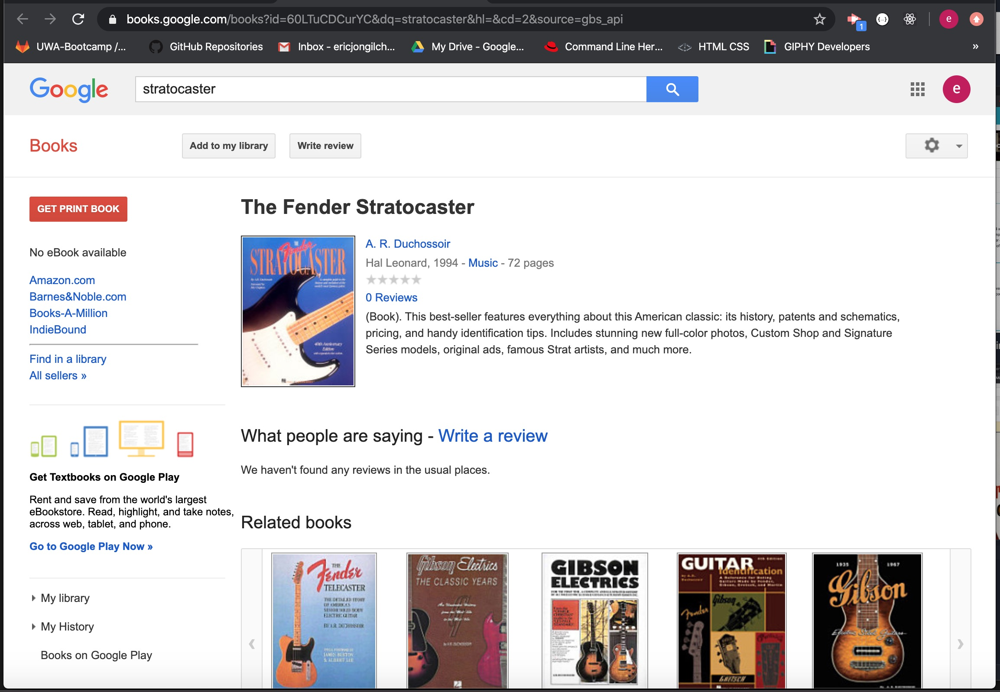

# google-books

## Overview
This app helps user to search books using Google Books API, and save books of interest in MongoDB. `View` button will links to the book's information link. `Delete` button will delete book from MongoDB.

## App running screenshot

Figure 1. Initial loading screen of the app

Figure 2. Book searched screen after entering search word "stratocaster"

Figure 3. `View` button click opens book's information link page

## Current development
- created Github repo
- created react app using boilerplate
- front-end
- components
- API
- book search and render to homepage
- `View` button click opens book's information link page

## Under construction
- routes
- `save` and `delete` button click handling
- connection to mongoDB 
- deploy to Heroku

## Technologies used
- HTML, CSS, Javascript, Bootstrap
- node, npm packages
- Google Books API
- Axios
- MongoDB, mongoose
- React, JSX

# Run App in Heroku
- link will be added upon development
